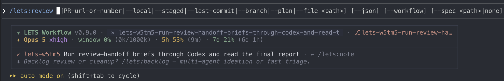

<div align="center">

# 🌱 LETS Workflow

**A development workflow plugin for Claude Code**

*Stop babysitting your AI. Start shipping with it.*

[](https://claude.com/claude-code)
[](CHANGELOG.md)

</div>

---

Claude Code is powerful, but without structure it drifts - forgets context between sessions, silently changes approach when something fails, reviews its own code with no outside perspective, and loses track of what was decided and why.

**LETS fix this.** You get a team of 14 specialized AI agents, a structured development workflow, and a PR review system that posts inline comments directly to GitHub - all from the terminal. Every session has a task. Every commit links to it. Context survives across sessions and conversation compaction.

## Why LETS?

**You don't just chat with AI. You run a process** — `/lets:*` commands and 14 expert agents cover the whole development cycle, every change is reviewed by the right specialists, and every decision is made deliberately, with you in the loop.

- **A complete workflow, not a chat box.** One loop from start to ship — restore context and pick a task, plan the work, build it, review it, open a PR, close the task. The plugin keeps Claude on the rails the whole way; nothing falls through the cracks.
- **Plan before you build.** Brainstorm and explore ideas, review and clean up the backlog, design the architecture with real codebase exploration and expert review, then execute step by step behind approval gates. Choices are made on purpose, not improvised.
- **Every change reviewed by the right experts.** 14 specialized agents select themselves based on what changed - security for auth code, database for migrations, architect for structure. Findings come tiered by severity, so you act on what matters. Plus an *actor* agent — point it at a senior iOS dev's profile, a UX designer's, anyone — and get their take.
- **You decide, always.** Commit, push, PR, merge - every state-changing step waits for your "go". The AI proposes and explains its reasoning; it never silently switches approach. Transparency by design.
- **Context that survives.** Tasks, decisions, and discovery notes live in [beads](https://github.com/steveyegge/beads) and outlast conversation compaction and new sessions - pick up exactly where you left off.
- **Built for teams.** Shared task database via [Dolt](https://github.com/dolthub/dolt), Agent Teams that implement multiple tasks in parallel (each in its own worktree, plan approved by the lead), and worktrees for hands-on parallel sessions.
- **GitHub-native PR review.** Agents analyze the PR, you discuss findings, they post inline comments to the exact lines, follow up on fixes, approve or request changes - without leaving the terminal.
- **Built on the latest Claude Code features.** Ultrathink for deep analysis, interactive UI for decisions, native plan mode for execution.

<div align="center">



*LETS statusline and `/lets:review` command in action*

</div>

## 🚀 Quick Start

LETS is two pieces: a small `lets` CLI on your `$PATH`, and the plugin inside Claude Code. Install both, then initialize your project.

### 1. Install the CLI

macOS / Linux:

```bash
curl -fsSL https://raw.githubusercontent.com/restarter/lets-workflow/main/scripts/install.sh | bash
```

You also need [beads](https://github.com/steveyegge/beads) (`bd`) on `$PATH` — LETS uses it for task tracking. You don't have to learn beads: the plugin drives `bd` entirely for you, so just get it installed. Its [install guide](https://github.com/steveyegge/beads#installation) has all the options; the quick one-liner:

```bash
curl -fsSL https://raw.githubusercontent.com/steveyegge/beads/main/scripts/install.sh | bash
```

Manual download, Windows, source builds, troubleshooting → **[docs/installation.md](docs/installation.md)**.

### 2. Install the plugin

In Claude Code:

```
/plugin marketplace add restarter/lets-workflow
/plugin install lets
```

> **Install scope:** Claude Code will ask where to install — pick **one of these two**:
>
> - **"Install for all collaborators on this repository"** *(project scope)* — recommended for shared repos; the choice lands in `.claude/settings.json`, so teammates inherit `lets` without re-installing.
> - **"Install for you, in this repo only"** *(local scope)* — fine for a solo or throwaway project; not committed.
>
> Don't pick the remaining option (install for yourself **everywhere** / user scope): there the SessionStart/PreCompact hooks fire in *every* project you open, including ones that never ran `/lets:init`. Smoother user-scope handling is planned for a future update.

**Stay current:** in `/plugin` → **Marketplaces** → `lets-workflow`, **Enable auto-update** — then the plugin updates itself on startup and you never think about it again. (To update by hand instead: `/plugin marketplace update lets-workflow`, then `/reload-plugins` — or just restart Claude Code.)

(Or install from a local clone — `git clone https://github.com/restarter/lets-workflow`, then `/plugin marketplace add ./lets-workflow` and `/plugin install lets` — handy for hacking on the plugin: edit the clone, then `/reload-plugins` to pick up your changes.)

### 3. Initialize your project

```bash
cd your-project
claude
```

Then, inside the Claude Code session:

```
/lets:init
```

`/lets:init` creates `.lets/` (config + statusline) and runs `bd init` if beads is installed. From there, start each work session with `/lets:start` — the full loop is in [Using LETS](#-using-lets) below.

## 📖 Commands

→ Full docs: [docs/commands.md](docs/commands.md)

### Session & Task

| Command | Description |
|---------|-------------|
| `/lets:start` | Start session - restore context, show tasks, create feature branch |
| `/lets:end` | End session - save progress, sync tasks, create summary (`--pre-compact` snapshots before /compact without ending) |
| `/lets:commit` | Commit with review and conventional commit format |
| `/lets:done` | Finish task - create PR (GitHub mode) or merge locally |
| `/lets:status` | Task overview and project status |
| `/lets:note` | Add note to active task (`--pre-compact` snapshots the session before /compact) |

### Planning & Execution

| Command | Description |
|---------|-------------|
| `/lets:brainstorm` | Quick interactive ideation on a topic - fast context scan, no agents |
| `/lets:backlog` | Backlog review (multi-agent) + interactive cleanup triage (Review `--workflow` = off-context) |
| `/lets:explore` | Explore a topic from multiple expert angles - scout, web research, agent fan-out (`--workflow` = off-context) |
| `/lets:plan` | Structured planning - explore codebase, design architecture, write plan (`--fast` = orchestrator-only, no subagents) |
| `/lets:execute` | Execute plan from `/lets:plan` via native plan mode |
| `/lets:team` | Parallel implementation with Agent Teams |
| `/lets:worktree` | Create/manage worktrees for parallel sessions |

### Review & Analysis

| Command | Description |
|---------|-------------|
| `/lets:check` | Quick inline sanity check (~30s, 6-perspective review) |
| `/lets:review` | Full code review with dynamic agent selection (~2-3 min) |
| `/lets:github-pr` | GitHub PR review lifecycle - analyze, discuss, post inline, follow-up, approve |
| `/lets:review-round` | Work through a received review round - triage comments, record decisions, one final edit-pass |
| `/lets:opinion` | Technical decision analysis (dynamic expert agents in parallel) |
| `/lets:ask` | Quick expert consultation (single agent) |

### Init & Update

| Command | Description |
|---------|-------------|
| `/lets:init` | Initialize LETS in current project |
| `/lets:update` | Sync project with the current release - `.lets/.env` + rules self-heal, plus version status for the `lets` binary and the plugin |

## 🤖 Expert Agents

→ Full docs: [docs/agents.md](docs/agents.md)

LETS ships **14 specialized agents**. You never pick them by hand — the commands that use agents (`/lets:review`, `/lets:opinion`, `/lets:ask`, `/lets:plan`, `/lets:backlog`, `/lets:team`) look at what you're doing and bring in only the ones that fit.

| Agent | Expertise |
|-------|-----------|
| architect | System design, patterns, SOLID, coupling |
| backend | APIs, business logic, error handling, performance |
| frontend | UI components, state management, accessibility |
| security | Vulnerabilities, auth, crypto, secrets, input validation |
| database | Schema design, migrations, query optimization, transactions |
| devops | Docker, CI/CD, deployment config, shell scripts |
| qa | Test strategy, coverage, assertion quality, mocking |
| compliance | Project standards and conventions (`CLAUDE.md`, style) |
| docs | Documentation sync, README accuracy, changelog |
| pragmatist | ROI analysis, overengineering detection, scope creep |
| git-historian | Blame analysis, past-decision context, change patterns |
| explorer | Codebase mapping, pattern discovery (used in `/lets:plan`) |
| implementer | Full-stack implementation (used by `/lets:team`) |
| actor | Any expert personality loaded from a URL or local file |

**Dynamic selection.** Each command analyzes the change (or the plan, or the question) and selects only the experts that matter — touch auth code and security, backend, and architect join; a pure docs update gets docs + compliance and nothing else; a full-stack feature can pull in up to 12, each focused on its domain. (`compliance` and `docs` always join a review. For plan reviews, the picks come from signals in the plan text — migrations, API endpoints, Docker configs, ….)

**Tiered findings.** Every finding is `[BLOCKER]` (must fix), `[SUGGESTION]` (should fix), or `[NIT]` (nice to have). Agents are tuned to skip the obvious and surface what actually matters — signal, not a wall of nitpicks.

**Modes.** The same agent behaves differently depending on context — *review* for code review, *opinion* for a technical decision, *plan* for evaluating an architecture, *brainstorm* for ideation, *ask* for a direct question. Same expertise, different lens.

**Read-only by default.** Agents analyze; they never touch your code. The one exception is `implementer`, which gets write access for parallel implementation via `/lets:team` (in an isolated worktree, behind your plan approval).

**The actor agent.** Give `actor` a personality — a URL or a local file — and it adopts that persona, then works with LETS's structured output. A senior iOS dev on your Swift code, a UX designer on your components, anyone — point it at their writeup and get their take. It's never auto-selected; you confirm each personality before it's loaded.

---

## 🔧 Using LETS

→ Full docs: [docs/workflow.md](docs/workflow.md)

A LETS session runs a loop: start, work, commit, finish.

```
/lets:start ─── choose how to work ─── /lets:commit ─── /lets:done ─── /lets:end
```

**Start** - `/lets:start` restores context from the previous session, shows available tasks, and creates a feature branch. Context survives conversation compaction via beads task comments.

**Choose how to work** - depending on the task, you pick the approach:

```
┌─ You write code yourself ─────────────────────────────────────────────────┐
│  Write code with Claude. Use helpers along the way:                       │
│  /lets:opinion   Technical decision with expert agents                    │
│  /lets:ask       Quick question to a single expert                        │
│  /lets:check     Quick sanity check (6 perspectives, ~30s)                │
│  /lets:review    Full multi-agent code review (~2-3 min)                  │
│                                                                           │
├─ You plan, Claude builds ─────────────────────────────────────────────────┤
│  /lets:brainstorm  Quick ideation on a topic - fast, no agents            │
│  /lets:backlog     Backlog review (multi-agent) + cleanup triage          │
│  /lets:explore     Think through a topic - web-grounded, multi-expert     │
│  /lets:plan        Design how to build it - codebase exploration, arch    │
│  /lets:execute     Claude implements the plan with your approval gates    │
│                                                                           │
├─ Agents work in parallel ─────────────────────────────────────────────────┤
│  /lets:team        Spawn agents that implement multiple tasks at once     │
│  /lets:worktree    Open parallel sessions in separate terminals           │
└───────────────────────────────────────────────────────────────────────────┘
```

**Commit** - `/lets:commit` reviews changes and creates a conventional commit (`feat:`, `fix:`, `docs:`, …) linked to the active task.

**Finish** - `/lets:done` creates a PR on GitHub (or merges locally). `/lets:end` saves a session summary so the next conversation picks up where you left off.

### Plan, then build

→ Full docs: [docs/plan-execute.md](docs/plan-execute.md)

> **Think** → **Design** → **Build**

**Brainstorm** (`/lets:brainstorm`) - fast interactive ideation on a topic: a quick context scan (no agents), then a direct conversation. For a specific topic deep-dive, use `/lets:explore`.

**Backlog** (`/lets:backlog`) - manage the task backlog in two modes: *Review backlog* (agents analyze your task list, find patterns, suggest priorities) and *Cleanup* (find stale tasks, broken dependencies, forgotten work). `/lets:backlog review` and `/lets:backlog cleanup` skip the menu. `/lets:backlog review --workflow` runs the Review fan-out off-context.

**Explore** (`/lets:explore`) - think through a specific topic or idea from multiple expert angles. A scout gathers project context, a web-research pass pulls current community standards, then parallel domain agents surface insights, open questions, and approaches. `--workflow` runs the fan-out off-context.

**Plan** (`/lets:plan`) - codebase exploration with dynamically-scaled explorer agents, then architecture design with expert evaluation. Small project? One explorer. Large monorepo? Up to 10, each mapping a different area. Want a quick talk-through instead? `/lets:plan --fast` skips the subagent phases and plans collaboratively in-session.

**Execute** (`/lets:execute`) - implements the plan step by step in native plan mode. You approve each step before Claude proceeds. No surprises.

### Code review

→ Full docs: [docs/code-review.md](docs/code-review.md)

Three levels of review, from 30-second sanity check to full PR lifecycle:

| Need | Command | Time | What happens |
|------|---------|------|-------------|
| Quick pre-commit check | `/lets:check` | ~30s | Inline 6-lens review: bugs, security, performance, quality, compliance, docs |
| Full code review | `/lets:review` | ~2-3 min | Dynamic agent selection - only relevant experts for your changes |
| Full PR lifecycle (GitHub) | `/lets:github-pr <PR>` | Interactive | Analyze, discuss, post inline comments, follow up on fixes, approve |

#### GitHub PR Review Lifecycle (`/lets:github-pr`)

This is where LETS shines. Instead of reviewing PRs in a browser, you do it from the terminal with expert agents. GitHub only — Bitbucket/local flows aren't implemented (those finish tasks via `/lets:done`):

```
/lets:github-pr https://github.com/owner/repo/pull/42
```

1. **Analyze** - agents review the PR based on what actually changed (security agent for auth code, database for migrations, etc.)
2. **Discuss** - you see each finding with code context, decide what to post: inline comment, summary, or drop
3. **Post** - batch-posts inline comments to the exact lines on GitHub, with a review summary
4. **Follow up** - after the author pushes fixes, `/lets:github-pr --follow-up` checks each finding: fixed, not fixed, or needs discussion
5. **Approve** - `/lets:github-pr --approve` when ready, or request changes

Authors can respond with `/lets:github-pr --respond` - triage comments, auto-fix mechanical issues, post replies.

### Working in parallel

→ Full docs: [docs/parallel-work.md](docs/parallel-work.md)

Two ways to work on multiple tasks at once:

**Agent Teams (autonomous)** — spawn multiple agents that work in parallel, each in an isolated worktree:

```
/lets:team run    # select tasks, agents start working
```

Each teammate gets one task, creates a plan, waits for your approval, then implements. Commits are cherry-picked back. Dynamic teammate count - the system scales based on how many tasks you select.

**Worktrees (interactive)** — work on multiple tasks yourself in separate terminals:

```bash
/lets:worktree create auth-feature    # Terminal 1 (main repo)
cd .worktrees/auth-feature && claude  # Terminal 2 - start new session
```

Each worktree gets its own branch, shares the task database and config via symlinks. Full LETS workflow in each terminal.

### LETS Help Boxes

After key actions, Claude shows a contextual help box with the most likely next steps, so you always know what to do next:

```
┌─ LETS ─────────────────────────┐
│  Review?  /lets:review         │
│  Commit?  /lets:commit         │
└────────────────────────────────┘
```

---

## 📋 Task Integration

→ Full docs: [docs/tasks.md](docs/tasks.md)

LETS uses [beads](https://github.com/steveyegge/beads) for persistent task tracking that survives conversation compaction:

- Every session starts by selecting a task, every commit links to it
- Discovery notes and decisions are saved as task comments - they survive context window limits
- Task dependencies and blocking tracked - `/lets:status` shows what's ready to work on
- Multi-developer: shared task database via [Dolt](https://github.com/dolthub/dolt) remotes - everyone sees the same backlog

## ⚙️ Configuration

→ Full docs: [docs/configuration.md](docs/configuration.md)

After `/lets:init`, edit `.lets/.env`:

```env
# Default response language — write the English name, like every value here (English, Ukrainian, Russian, Japanese, ...)
LETS_LANGUAGE=English

# Target branch for merges and PR base
LETS_MERGE_BRANCH=main

# PR flow: github | bitbucket | local
LETS_PR_FLOW=github

# Task tracker (currently beads supported)
LETS_TRACKER=beads
```

All plugin-generated files live under `.lets/` (gitignored); interactive worktrees under `.worktrees/`.

### Statusline

`/lets:init` wires the LETS statusline into `.claude/settings.json` (`lets statusline`). By default it draws a bordered multi-line box — identity (brand, folder/worktree, branch, diff, PR), budget (model + effort + usage), task, and a rotating tip line — width-responsive (Full ≥72 cols, Compact below), universal text glyphs (no Nerd Font or emoji needed), light/dark palettes.

Flags (set in `settings.json`'s `command`):

| Flag / env | Effect |
|---|---|
| `--light` | Light-terminal palette (default dark) |
| `--no-tip` *(or env `LETS_STATUSLINE_TIP=off`)* | Hide the bottom tip line |
| `--no-dir` *(or env `LETS_STATUSLINE_DIR=off`)* | Hide the location pill |
| `--no-task` *(or env `LETS_STATUSLINE_TASK=off`)* | Hide the task line (also skips the background `bd` refresh) |
| `--compact` | Legacy 2-line bar (fallback if the box misbehaves) |

```json
{
  "statusLine": {
    "type": "command",
    "command": "lets statusline --light"
  }
}
```

Add `--light` for light-background terminals (default palette is dark). Full details — line anatomy, width tiers, worktree behavior — in **[docs/statusline.md](docs/statusline.md)**.

## 📦 Dependencies

| Dependency | Required | Purpose |
|------------|----------|---------|
| [Claude Code](https://claude.com/claude-code) | Yes | AI coding agent (the thing LETS plugs into) |
| [git](https://git-scm.com/) | Yes | Version control, branching, worktrees |
| [beads](https://github.com/steveyegge/beads) | Yes | Task tracking and issue management (Claude Code plugin) |
| [gh](https://cli.github.com/) | Optional | GitHub PR workflow (when `LETS_PR_FLOW=github`) |
| [jq](https://jqlang.github.io/jq/) | Optional | Statusline JSON parsing |

## 📚 Documentation

The README is the tour; **[docs/](docs/)** is the manual.

| Doc | What's in it |
|-----|--------------|
| [installation.md](docs/installation.md) | Install the `lets` binary and the Claude Code plugin, initialize a project. Troubleshooting and uninstall. |
| [workflow.md](docs/workflow.md) | The day-to-day loop — session lifecycle, the three ways to work, LETS boxes, how the hooks keep Claude on track. |
| [plan-execute.md](docs/plan-execute.md) | The plan → execute flow — `/lets:plan` designs the change with codebase exploration and expert review, `/lets:execute` implements it behind approval gates. |
| [code-review.md](docs/code-review.md) | Three levels of review — `/lets:check`, `/lets:review`, and `/lets:github-pr` (analyze, post inline, follow up, approve). Dynamic agent selection. |
| [agents.md](docs/agents.md) | The 14 expert agents, what triggers each, tiered scoring, agent modes, and the actor agent. |
| [parallel-work.md](docs/parallel-work.md) | Working on several tasks at once — `/lets:team` (autonomous agents) and `/lets:worktree` (parallel terminals). |
| [tasks.md](docs/tasks.md) | Task tracking with beads — the task lifecycle, taking and creating tasks, notes, `/lets:brainstorm`, `/lets:backlog`, beads memory, shared backlogs for teams. |
| [commands.md](docs/commands.md) | Full reference for every `/lets:*` command. |
| [configuration.md](docs/configuration.md) | `.lets/.env` settings, the `.lets/` file layout, `lets init` vs `bd init` setup order, and dependencies. |

Building on the plugin itself? See [`CONTRIBUTING.md`](CONTRIBUTING.md) and [`CLAUDE.md`](CLAUDE.md).

## License

MIT
